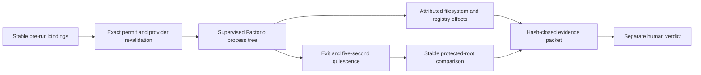

# Hermetic standalone Play policy

Status: frozen criteria, no candidate implementation, no run, no verdict, and
no authority.

Canonical policy identity:

```text
policy_id       facman.hermetic-standalone-play.2.0.77.windows-x64.v1
policy_revision 1
claim_id        factorio.hermetic_process_tree.v1
policy_digest   6fde31f26d57e23d67c01dd598cb869a4914d11711868b46d4f817709455e7a2
```

The machine-readable source is
[`contracts/policy/factorio/hermetic_standalone_play_2_0_77_windows_x64.v1.toml`](../../contracts/policy/factorio/hermetic_standalone_play_2_0_77_windows_x64.v1.toml).
The policy digest is SHA-256 over the decoded policy after removing only the
`policy_digest` field and encoding it with `facman.sorted-json.v1`.

## Frozen claim

The first candidate uses the player-facing label **Hermetic standalone**, but
the evidence claim is deliberately narrower:

> No persistent filesystem or registry write attributable to FacMan,
> Factorio, or their supervised process tree may occur outside the exact
> writable resources bound by the reviewed operation.

This is a process-tree and protected-domain claim. It is not whole-host
immutability. Windows servicing, antivirus, drivers, telemetry, other user
processes, and host state outside enumerated or attributable domains remain an
explicit `external_unobserved` class. A future whole-host claim would require a
separately frozen disposable-machine policy and system-wide comparison.

## Candidate class

The policy admits only this class:

| Dimension | Frozen value |
| --- | --- |
| Platform | Windows x64 |
| Factorio | exactly 2.0.77 |
| Distribution | authenticated Wube standalone, non-Steam |
| Executable authentication | stable identity and SHA-256 bound to authenticated source evidence |
| Storage | fixed local NTFS volume |
| Traversal | no links or reparse points in any bound closure |
| Instance | FacMan-owned mutable root |
| Content | base game required; optional installed content is capability evidence, not entitlement |
| Mods | explicit empty lock |
| Account, credentials, network | none |
| Intent | `menu` only |
| Isolation | `hermetic` only |
| Temporary state | exact workspace operation-temporary root only |

The policy binds current Universal Launcher and Universal Setup dependency
revisions. The future FacMan candidate, process provider, and observation
provider must each bind an exact reviewed revision in the candidate evidence;
the policy does not invent those future identities.

## Resource law

Paths are selectors used to resolve machine resources. They do not grant
authority by prefix. Every selected filesystem root must be rebound to stable
object, volume, filesystem, and no-follow evidence before the operation. A
sibling under the same parent is a different resource.

### Writable resources

The exact writable set contains 13 logical resources:

```text
instance.config
instance.mods
instance.saves
instance.scenarios
instance.script_output
instance.logs
instance.crash
instance.cache
instance.state
instance.locks
operation.record
workspace.audit
operation.temporary
```

The operation record and temporary resource include the exact operation ID.
The policy does not authorize the whole `operations/`, `temporary/`, instance,
or workspace parent. OS-global temporary directories are outside the writable
set.

### Protected and observed domains

| Class | Required treatment |
| --- | --- |
| `protected_snapshot` | Stable pre/post identity and manifest comparison; attributed writes fail. |
| `forbidden_observed` | Every attributed effect is observed; any write fails. |
| `external_unobserved` | Outside the claim and disclosed; never represented as unchanged. |
| `not_applicable` | A machine-local disposition for an absent domain, never silently assumed. |

The protected set covers the selected and sibling installations, default and
global Factorio data, Steam installation/user/cloud/cache state, the executing
FacMan package, other instances, source material, and relevant Factorio,
Steam, and uninstall registry domains. An absent protected root is recorded as
absent and must remain absent.

Two virtual forbidden scopes close the attributed-effect set:

```text
all filesystem targets outside exact writable resources
all registry targets outside exact writable resources
```

One explicit `host.external_unobserved` record prevents the process-tree claim
from being reported as a whole-host guarantee.

## Evidence spine

The 31 mandatory evidence bindings cover:

- exact FacMan build and source revision plus pinned provider revisions;
- policy revision and digest, machine binding, principal, and application
  session;
- `InstanceSpec`, `InstanceBinding`, and `InstanceReadiness` digests;
- installation evidence and stable root identity;
- executable stable identity, SHA-256, authenticated source, version, and
  content capabilities;
- effective configuration, `read-data`, `write-data`, mod root, and explicit
  empty-lock state;
- `menu`, `hermetic`, and exact launch-plan identity and digest;
- protected and writable baseline manifests; and
- independent observation-provider identity and revision.

Every item is recorded in the hash-closed evidence packet. Credential values,
tokens, and other secrets are forbidden from the packet.

## Independent observation

The policy requires both observation methods:



`factorio.play.process_tree_effects.v1` observes FacMan, Factorio, supervised
children, and explicitly named provider processes during the run.
`factorio.play.protected_comparison.v1` compares presence, stable identities,
bounded manifests, hashes, and registry values after exit and a five-second
quiescence interval.

Lost events, buffer overflow, unknown process identity, unresolved targets,
delayed events, attribution gaps, incomplete manifests, or provider failure
force `Inconclusive`. They cannot be waived into `Pass`.

## Player journey

The later human verdict must observe this exact journey:

```text
select instance
→ inspect readiness
→ review exact menu plan
→ obtain one exact permit
→ provider independently revalidates
→ open Factorio to its normal main menu
→ confirm no save was inferred
→ create a disposable game or explicitly load the test save
→ save and return to menu
→ exit normally
→ inspect post-run evidence and last-run state
→ relaunch with fresh authority
→ confirm the same instance sees the save
→ exit normally
```

The first launch cannot infer a save or scenario, start a server, open the
editor, run a benchmark, connect to multiplayer, update Factorio or mods, or
read a credential.

## Interruption matrix

Twenty-one automated cases cover permit mutation/replay/expiry, wrong intent
or isolation, evidence drift, sibling/concurrent launch, cancellation,
timeout, crash, journal failure, stale locks, restarts, and observer loss.
Seven human cases establish menu arrival, no inferred save, create/load, save,
clean exit, truthful last-run reporting, and relaunch persistence. Abrupt power
loss remains a synthetic-deferred case until a disposable-machine lane exists.

Expected refusal, consumption, recovery, and verdict effects are frozen per
case. A permit is consumed only at the provider effect boundary and never
becomes reusable after interruption.

## Verdict law

### Pass

`Pass` requires exact identity agreement, one-time consumption, the normal
menu, no inferred alternate intent, usable instance state, successful save and
freshly authorized relaunch, no external attributed write, unchanged protected
state, complete observation, honest lifecycle state, and a human signature on
the exact hash-closed packet.

A Pass does not grant authority. It makes only the exact reviewed candidate
eligible for a separate route-promotion review.

### Fail

Attributable external writes, protected-state changes, wrong intent, implicit
save loading, accepted stale/replayed authority, resource substitution,
candidate-caused journey failure, or falsely complete recovery/run state
produce `Fail`. Repair work remains bound to the observed failure; the frozen
criteria are not weakened retroactively.

### Inconclusive

Observation gaps, incomplete comparison, candidate drift, attribution
interference, host/provider restart, unavailable human UI confirmation,
ambiguous identity, or an incomplete/corrupt/unclosed packet require
`Inconclusive`. Observation may be improved and the same policy repeated, or a
new policy revision may be reviewed with an explicit reason.

## Governance and authority boundary

The required order is:

```text
policy implementation review on dev
→ policy closeout review
→ no-authority canonical policy promotion to main
→ main ancestry synchronization into dev
→ separate candidate implementation
→ separate technical closeout
→ separate human verdict
```

While this policy WorkUnit is active, the repository has no public permit
command, product issuer, process execution, real Factorio route, product apply,
Setup, credential, network, host-mutation, signing, publication, or Safe-beta
authority. The policy is test law only.
