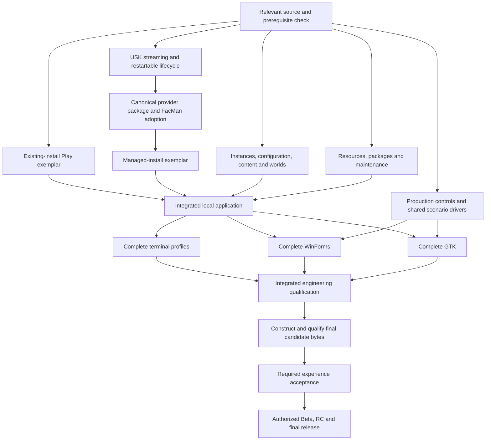

# Roadmap: outcomes before dates

This is an advisory view of the integrated delivery direction. Milestones describe results; they do not allocate tags, create branches or activate support. See [MASTER_PLAN](MASTER_PLAN.md), [TODO](TODO.md) and
[acceptance](ACCEPTANCE.md).

## The path to 0.1

| Milestone | Demonstrable exit | Can begin before it closes |
|---|---|---|
| M0 — Reconciled starting point | Integrated contributions correctly mapped; required outcomes/profiles and specific next prerequisites identified | Existing-install lab preparation, provider inspection, terminal fixtures, native gallery |
| M1A — Existing-install exemplar | Packaged read-only registration → isolated instance → real menu → Last Run → relaunch and uncertainty recovery | Content/world work and managed lifecycle |
| M1B — Managed-install exemplar | Accepted local source → verified generation → repair → interrupted-operation recovery → removal with preservation | Existing-install Play, maintenance audit, native controls |
| M2 — Integrated local application | Instances/configuration/content/worlds/readiness and both exemplars converge; recovery and maintenance semantics work | Terminal and native adapters advance with each stable slice |
| M3 — Complete terminal | Human CLI, JSON/RPC and both TUI modes close required local outcomes from declared packages on all admitted terminal targets | WinForms and GTK completion; AppKit preview tests remain current |
| M4 — Complete native references | WinForms and GTK ordinary workflows plus their native/input/accessibility engineering close | Delivery rehearsal and concentrated experience-test preparation |
| M5 — Feature-complete and machine-qualified | Complete required engineering matrix, integrated fault/compatibility/performance campaigns and no open release blockers | Final candidate construction and acceptance |
| M6 — Beta evaluation | Versioned final delivery bytes pass machine and required experience gates; publication follows current policy | Bounded defect repair and servicing rehearsal |
| M7 — RC and 0.1 | Frozen scope, accepted final identity, delivery/maintenance/withdrawal/support rehearsal and authorized release | Protected 0.1 servicing; bounded 0.2 charter |

The arrows show completion dependencies. Native implementation, terminal fixtures, package preparation and delivery preparation start earlier. AppKit preview qualification is also required before the integrated
engineering checkpoint; full AppKit graduation remains later.

Neither exemplar is assigned an arbitrary calendar deadline. Alpha.6/Alpha.7 remain meaningful engineering milestone labels, not an obligation to fit every remaining change into exactly two candidates. Allocate an actual
prerelease only for a retained, release-significant candidate under the existing policy.

## Release train

| Train | Product result | Entry/exit discipline |
|---|---|---|
| 0.1 | Complete local product, cross-platform terminal, WinForms/GTK references, maintained AppKit preview | M0–M7; exact admitted profiles and local source formats |
| 0.1.x | Compatible reliability, recovery, security, accessibility and packaging fixes | Servicing line; regression and migration coverage; forward-port repairs |
| 0.2 | Credentials, official acquisition, Mod Portal, verified resumable transfers/cache and offline fallback | Network/credential admission; verified local artifact handoff; terminal and existing desktop parity |
| 0.3 | Bounded local hosting, setup/configuration, content/world binding, supervision, graceful stop, backup/update/recovery | Hosting authority and exposed interfaces explicitly scoped; existing clients stay current |
| 0.4 | Complete AppKit/native Mac experience over applicable capabilities through 0.3 | Current product parity, native interaction/accessibility and package lifecycle acceptance |
| After 0.4, before 0.9 | Individually admitted targets, integrations, SDK/provider consumers and optional frontends | Named user need, owner, support budget, compatibility impact and measurable exit |
| 0.9 | Freeze the actual 1.0 product/API/state/provider/frontend/target/support contract | Remove ambiguity; prove supported migration and servicing; close admitted gaps |
| 1.0 | Supported admitted product and stable consumed contracts | Required native desktops, exact delivery, experience and operational support complete |
| 1.x | Compatible expansion and maintenance | Additions cannot invalidate supported contracts |
| 2.0, if needed | Justified incompatible contract evolution | Explicit migration/transition; no automatic rewrite milestone |

Do not allocate mandatory features to every 0.5–0.8 number now. Optional Qt, WinUI, SwiftUI, web, remote administration, executable extensions and other platform expansions compete for admission after the required product works.

Before claiming provider-subset stability at 1.0, use the repository's real-consumer criterion. Start materially different consumer work before 0.9. Two frontends, two FacMan profiles or a synthetic sample do not
establish two different products. This does not make another product's entire roadmap a FacMan 0.1 dependency.

## Planning cadence and forecast

The next block selects at most six outcomes from [NEXT_EXECUTION_BRIEF](NEXT_EXECUTION_BRIEF.md). The next integration cycle aims to close both exemplars and the first genuine native scenario. These are priorities, not
promises that all fit in a night or week.

Reassess at each milestone using actual slice cycle times, integration waiting, available target hosts and newly reproduced failures. Only then estimate a range. Keep engineering time and external waiting separate. If
the estimate grows, reduce unnecessary implementation breadth inside the agreed contract before proposing any explicit scope change.

Use one main product focus, one major provider/persistence focus and one interface/verification focus within current repository WIP limits. Do not impose a serial WinForms → GTK dependency, global three-host provisioning
gate, or ULK documentation → USK runtime dependency.

Before `main` advances to a later minor, resolve the normal-tag maintenance-line policy so 0.1.x can be serviced without moving `main` backward. Preserve immutable release tags and accepted artifacts. Source promotion,
provider adoption, package acceptance and publication remain different events.
